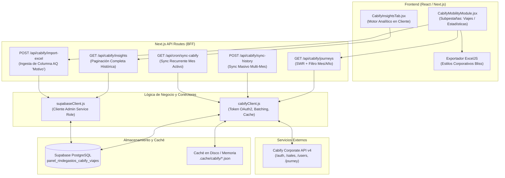

# Arquitectura Técnica — Módulo de Movilidad Cabify Empresas

**Proyecto:** RindeGastos & Dataverse Admin (BlissCorp)  
**Entorno:** Next.js 14 (App Router) + Supabase + Cabify Corporate API v4  
**Fecha de actualización:** Octubre 2026  
**Autor:** Staff Software Engineer  

---

## 1. Visión General del Módulo

El **Módulo de Movilidad Cabify** permite auditar, analizar y exportar los gastos de transporte corporativo de BlissCorp y sus empresas vinculadas. Resuelve la dispersión de datos de facturación mediante un modelo híbrido de **alta velocidad y persistencia**, evitando bloqueos por rate limits de Cabify y permitiendo análisis analíticos avanzados (insights, carpooling simultáneo, centros de costos y outliers) en tiempo real.



---

## 2. Flujo de Datos y Estrategia de Caché Híbrida

Para garantizar respuestas en **menos de 300 ms** en el navegador y mitigar la lentitud o caída de la API externa de Cabify, el sistema implementa una jerarquía de 4 niveles de lectura:

```
[1. Memoria RAM (Maps en cabifyClient.js)]
        ↓ (Si expira o no existe)
[2. Supabase DB (panel_rindegastos_cabify_viajes)]
        ↓ (Si no hay datos persistidos)
[3. Caché de Disco (.cache/cabify/*.json)]
        ↓ (Si se fuerza refresh o no hay caché)
[4. Cabify Corporate API v4 (HTTP con Backoff y Reintentos)]
```

### Estrategia Stale-While-Revalidate (SWR)
Cuando el usuario visualiza el **mes en curso**, el servidor:
1. Retorna instantáneamente los datos disponibles en **Supabase**.
2. Evalúa la antigüedad mediante `lastSyncAt`.
3. Si los datos tienen **más de 15 minutos**, la cabecera `needsBackgroundRevalidation: true` instruye al frontend a disparar una sincronización transparente en segundo plano que actualiza la base de datos sin congelar la UI.

---

## 3. Capa de Integración con Cabify API (`src/lib/cabifyClient.js`)

### 3.1. Autenticación OAuth 2.0 (Client Credentials)
- **Endpoint:** `POST https://cabify.com/auth/api/authorization`
- **Body:** `grant_type=client_credentials&client_id=...&client_secret=...`
- **Gestión de Tokens:** El token Bearer se almacena en memoria (`cachedToken`). Se renueva automáticamente 2 minutos antes de su expiración para prevenir llamadas rechazadas con error 401.

### 3.2. Endpoints Consumidos de Cabify
| Endpoint | Método | Propósito | Frecuencia / TTL de Caché |
| :--- | :---: | :--- | :--- |
| `/api/v4/users?per=100` | `GET` | Directorio de colaboradores corporativos (nombre, apellido, email, teléfono). | 24 horas en disco (`users_map.json`). |
| `/api/v4/sales` | `GET` | Listado de transacciones/ventas corporativas por rango de fechas (`from`, `to`, `currency=PEN`). | Paginado (50 registros/pág). |
| `/api/v4/journey/{id}` | `GET` | Detalle específico del viaje (ruta, paradas, pasajero y centros de costo). | 60 días en disco (`journey_{id}.json`), datos inmutables. |

### 3.3. Control de Concurrencia y Resiliencia
- **Paralelismo Controlado:** Las ventas devuelven múltiples `journey_id`. Para evitar bloqueos por rate limiting (429 Too Many Requests), la resolución de pasajeros se ejecuta en lotes de **20 promesas concurrentes** (`processInBatches`).
- **Backoff Exponencial:** Función `axiosGetWithRetry` con hasta 2 reintentos y esperas incrementales (`attempt * 1200 ms`) ante fallas de red transitorias.

---

## 4. Capa de Persistencia en Supabase (`src/lib/supabaseClient.js`)

### 4.1. Esquema de Base de Datos
- **Tabla:** `panel_rindegastos_cabify_viajes` (referenciada vía constante `CABIFY_TABLE`).
- **Esquema de Columnas:**

| Columna | Tipo SQL | Descripción |
| :--- | :--- | :--- |
| `id` | `VARCHAR` (PK) | Identificador único del viaje (Ticket Code o Journey ID). |
| `ticket_code` | `VARCHAR` | Código de factura/comprobante de Cabify (ej. `BX01-22283730`). |
| `journey_id` | `VARCHAR` | UUID del viaje en la plataforma Cabify. |
| `invoice_date` | `DATE` | Fecha contable de facturación (`YYYY-MM-DD`). |
| `start_at` | `TIMESTAMPTZ` | Timestamp exacto de inicio del viaje (UTC). |
| `end_at` | `TIMESTAMPTZ` | Timestamp de finalización del viaje (UTC). |
| `rider_id` | `VARCHAR` | ID de usuario de Cabify Empresas. |
| `rider_name` | `VARCHAR` | Nombre completo del colaborador que viajó. |
| `rider_email` | `VARCHAR` | Correo corporativo del pasajero. |
| `rider_phone` | `VARCHAR` | Número móvil registrado. |
| `origin` | `TEXT` | Dirección o geolocalización de recogida. |
| `destination` | `TEXT` | Dirección o geolocalización de destino. |
| `charge_code` | `VARCHAR` | Centro de costo / código de imputación contable. |
| `motivo` | `TEXT` | Justificación del viaje ingresada por el colaborador (exportada de Cabify). |
| `description` | `TEXT` | Notas u observaciones del traslado. |
| `total_pen` | `NUMERIC(10,2)` | Importe total del viaje en Soles peruanos (`PEN`). |
| `currency` | `VARCHAR(3)` | Moneda de liquidación (`PEN`). |
| `updated_at` | `TIMESTAMPTZ` | Última fecha/hora de sincronización o enriquecimiento. |

### 4.2. Ingesta y Preservación de Motivos (`upsertJourneysToSupabase`)
Al sincronizar datos desde la API de Cabify hacia Supabase:
1. La API pública de Cabify no expone el campo textual `motivo` (este solo viene en el reporte Excel de auditoría de Cabify Empresas).
2. Para **no sobreescribir con `null` los motivos ya existentes en Supabase**, la función consulta previamente los `motivo` de los IDs del lote y los fusiona en memoria antes de ejecutar el `upsert`:
   ```javascript
   const finalMotivo = j.motivo || existingMotivosMap.get(rowId) || null;
   ```
3. La inserción se ejecuta en bloques seguros de 100 registros con cláusula `onConflict: 'id'`.

---

## 5. Endpoints de Backend (Next.js App Router)

### 1. `GET /api/cabify/journeys`
- **Ubicación:** `src/app/api/cabify/journeys/route.js`
- **Parámetros:** `month`, `year`, `from`, `to`, `refresh`
- **Comportamiento:** Resuelve viajes del período mensual seleccionado. Prioriza Supabase salvo que se envíe `refresh=true`. Notifica mediante `needsBackgroundRevalidation` si el mes en curso requiere refresh en segundo plano.

### 2. `GET /api/cabify/insights`
- **Ubicación:** `src/app/api/cabify/insights/route.js`
- **Comportamiento:** Paginación continua en bloques de 1,000 registros (`.range(from, from + pageSize - 1)`) sobre `panel_rindegastos_cabify_viajes` ordenados cronológicamente. Retorna el histórico íntegro acumulado multi-mes para procesamiento matemático en la pestaña de Insights.

### 3. `POST /api/cabify/sync-history`
- **Ubicación:** `src/app/api/cabify/sync-history/route.js`
- **Comportamiento:** Sincronizador batch masivo. Recibe `year`, `fromMonth`, `toMonth`, `force`. Itera mes a mes descargando viajes desde la API de Cabify y consolidándolos en Supabase. Si un mes histórico ya existe en Supabase y `force=false`, se omite para optimizar tiempo de ejecución.

### 4. `POST /api/cabify/import-excel`
- **Ubicación:** `src/app/api/cabify/import-excel/route.js`
- **Comportamiento:** Ingesta de reportes Excel oficiales de Cabify Empresas. Lee dinámicamente la hoja de cálculo buscando la cabecera "Motivo" o la **Columna AQ** (índice 42). Cruza por `ticket_code` o `journey_id` y actualiza masivamente el campo `motivo` en Supabase.

### 5. `GET / POST /api/cron/sync-cabify`
- **Ubicación:** `src/app/api/cron/sync-cabify/route.js`
- **Comportamiento:** Endpoint de automatización periódica. Sincroniza forzadamente el mes en curso contra la API de Cabify y persiste en Supabase. Diseñado para invocaciones programadas (Vercel Cron o schedulers externos).

---

## 6. Arquitectura Frontend y UI

### 6.1. `CabifyMobilityModule.jsx` (Contenedor Principal)
- **Subpestañas:**
  1. `viajes`: Vista tabular detallada con filtros reactivos (colaborador, centros de costo, buscador libre con coincidencia difusa, modal de detalle de trayecto).
  2. `estadisticas`: Tarjetas de KPI principales (gasto total, viajes totales, ticket promedio, usuario top) y rankings por colaborador y centro de costo.
  3. `insights`: Monta el componente `CabifyInsightsTab`.
- **Prevención de Condiciones de Carrera (Race Conditions):**
  - Implementa `selectedMonthRef` y `selectedYearRef` junto con `AbortController`. Si el usuario cambia rápidamente de mes en el selector mientras una revalidación SWR está en curso, las respuestas obsoletas son abortadas e ignoradas inmediatamente, impidiendo la sobreescritura errónea de datos en pantalla.
- **Exportación Excel de Alta Fidelidad:**
  - Emplea `exceljs` en el cliente para generar archivos `.xlsx` estilizados con cabeceras en azul marino Bliss (`#0E2A43`), formatos de moneda peruanos (`S/ #,##0.00`), fechas localizadas y auto-ajuste de anchos de columna.

### 6.2. `CabifyInsightsTab.jsx` (Motor de Analítica Avanzada)
Ejecuta algoritmos reactivos en memoria sobre el conjunto completo de viajes:

1. **Top 10 Destinos Frecuentes:** Ranking de destinos agregados con volumen de viajes, colaboradores únicos y costo promedio por traslado.
2. **Viajes Simultáneos al Mismo Destino (Carpooling):**
   - **Algoritmo:** Ventana temporal deslizante de **±45 minutos** (`WINDOW_MS = 45 * 60 * 1000`).
   - Identifica grupos donde **2 o más colaboradores distintos** se dirigieron al mismo destino dentro del margen de 45 min.
   - Calcula el ahorro estimado potencial si hubiesen compartido la unidad.
   - Detalle expandible clickeable por grupo con desglose de tickets, pasajeros, horarios y montos.
3. **Hubs y Destinos Operativos Frecuentes:**
   - Detecta locaciones donde se registran **al menos 5 viajes** y han participado **al menos 3 colaboradores distintos**, ordenados por costo total acumulado (identificación de clientes frecuentes, tiendas recurrentes o sedes clave).
4. **Heatmap de Demanda Temporal:**
   - Matriz 7x24 (Días de la semana vs Horas del día).
   - Conversión determinista a zona horaria **Lima (UTC-5)** independientemente del huso horario del navegador del usuario.
5. **Detección de Viajes Atípicos (Outliers):**
   - Detección de traslados con importes significativamente elevados (> S/ 70) para auditoría de anomalías contables.
6. **Normalización Inteligente de "Casa":**
   - Resuelve el problema de destinos genéricos etiquetados como *"Casa"*, individualizándolos automáticamente por pasajero (`Casa - [Nombre del Colaborador]`) para no generar falsos positivos de carpooling ni concentraciones artificiales en un mismo punto fijo.
7. **Selector de Rango Libre:**
   - Rango de fechas `[ Desde — Hasta ]` exclusivo de la pestaña de Insights, con apertura nativa accesible vía `showPicker()` e iconos de calendario unificados.

---

## 7. Variables de Entorno Requeridas

| Variable | Tipo | Descripción |
| :--- | :--- | :--- |
| `CABIFY_CLIENT_ID` | Secreto | ID de cliente provisto por Cabify Empresas. |
| `CABIFY_CLIENT_SECRET` | Secreto | Clave secreta OAuth 2.0 de Cabify Empresas. |
| `CABIFY_AUTH_URL` | URL | Endpoint de autenticación (`https://cabify.com/auth/api/authorization`). |
| `CABIFY_API_BASE` | URL | Endpoint base de la API v4 (`https://cabify.com/api/v4`). |
| `SUPABASE_URL` | URL | URL del proyecto Supabase. |
| `SUPABASE_SERVICE_ROLE_KEY` | Secreto | Llave de administración para lectura y escritura masiva en Supabase. |
| `SUPABASE_CABIFY_TABLE` | Nombre | Nombre de la tabla persistente (`panel_rindegastos_cabify_viajes`). |

---

## 8. Verificación y Calidad de Código
- Todo el módulo cuenta con tipado semántico JSDoc, validaciones de errores con códigos de estado HTTP estándar (200, 400, 500, 503) y cumple con las directrices de accesibilidad WCAG / ARIA.
- Compilación verificada con éxito mediante `npm run build` sin advertencias de linter ni dependencias huérfanas.
